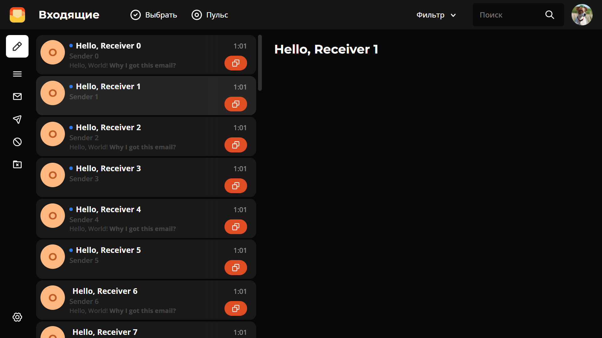
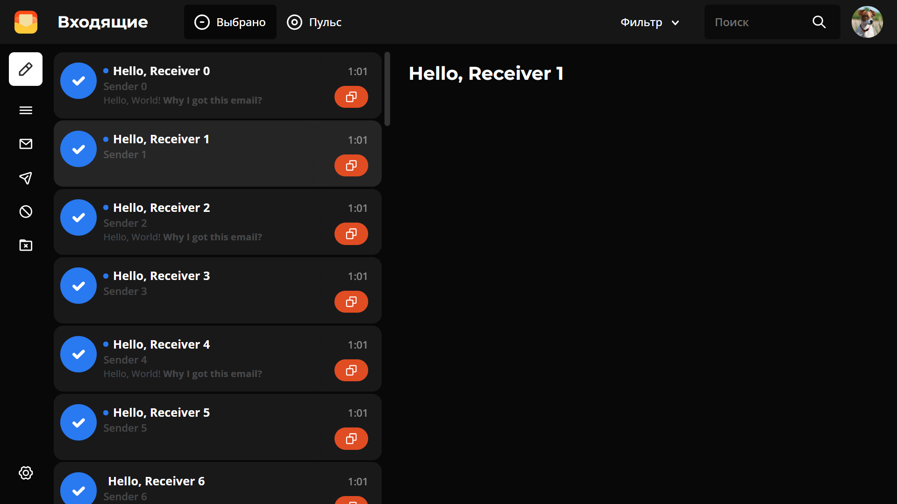
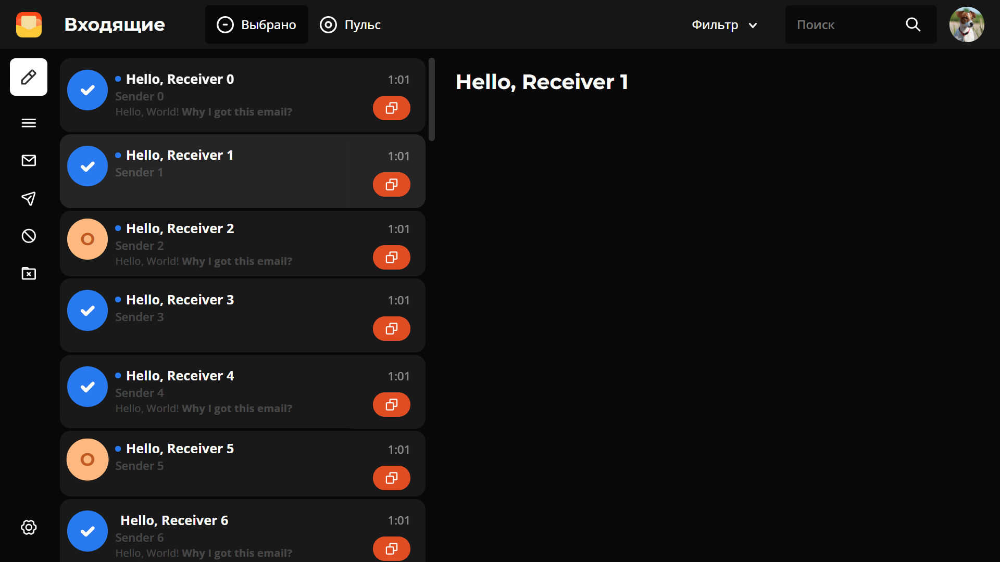
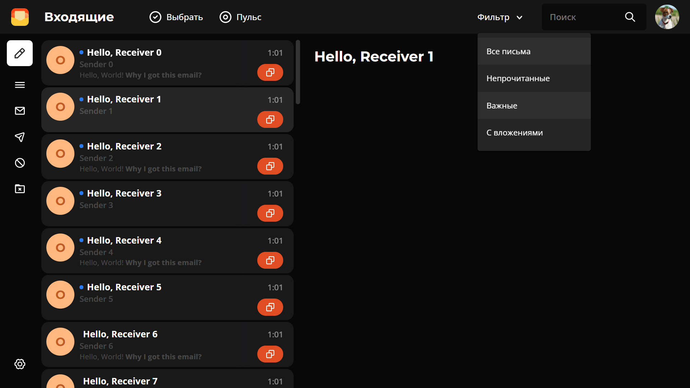
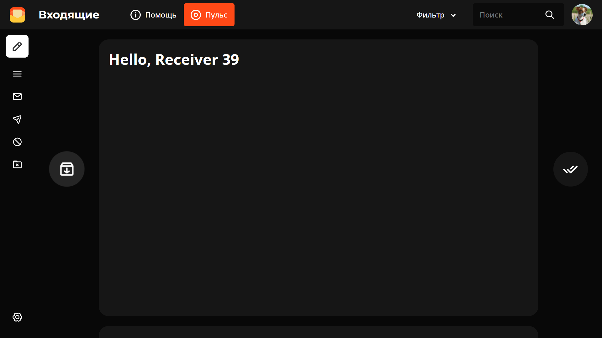

# OpenMail

OpenMail - is an opensource web-based mail client in process of development

## How to run?

1. Run `npm install`
2. Run `ng serve`
3. Navigate to `http://localhost:4200/`. The app will automatically reload if you change any of the source files.

## Screenshots

